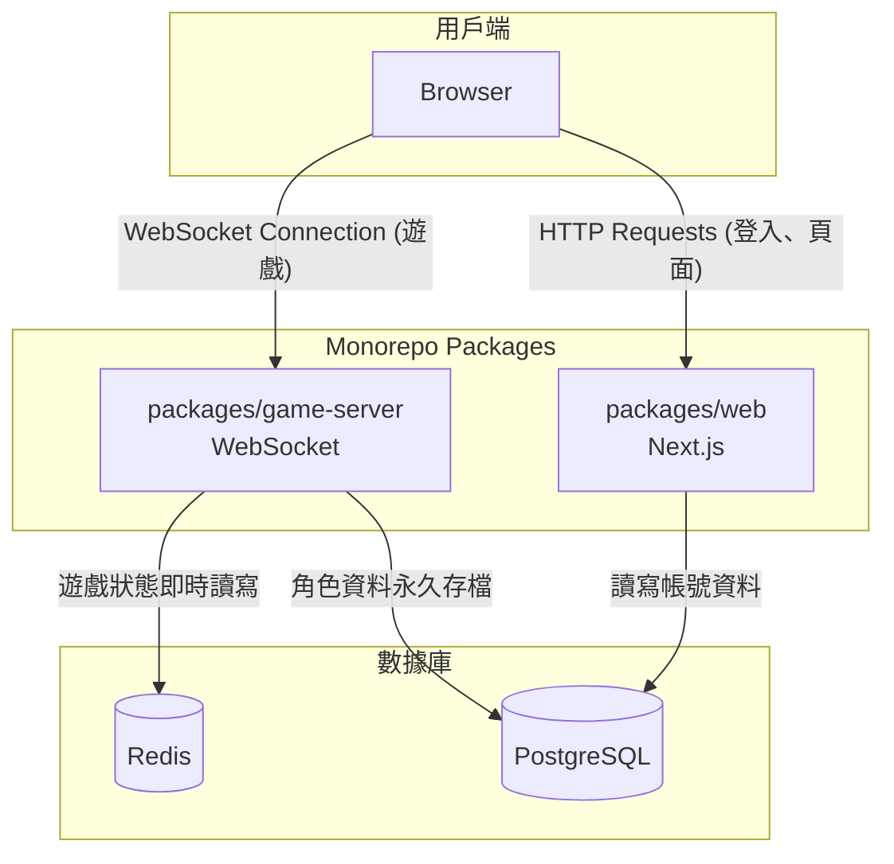

好的，這是一個根據您提供的專案文件生成的 `README.md`。

-----

# Anima - A Modern MUD Game Framework

Anima 是一個採用現代化技術棧和架構設計的可重用文字遊戲（MUD）核心框架。它的核心設計理念是將通用的**遊戲核心 (Core)** 與具體的**遊戲邏輯 (Game Logic)** 分離，如同汽車的底盤與車身。開發者可以基於這個穩固的「底盤」去打造各式各樣的遊戲「車身」。

## 核心理念：核心 vs. 遊戲邏輯

  - **核心 (Core)**: 如同汽車的**底盤**。它提供引擎、事件系統、物件模型等通用能力，定義了「如何運作」。
  - **遊戲邏輯 (Game Logic)**: 如同汽車的**車身**。它定義了遊戲世界的具體內容，如場景、NPC、任務等，定義了「是什麼樣子」。

## 專案狀態

**階段一：核心地基 - ✅ 完成**

  - `[x]` 專案初始化：建立 Monorepo 工作區。
  - `[x]` 共享類型定義 (`shared`)。
  - `[x]` 基礎物件實作 (`core`)。
  - `[x]` 事件系統 (`core`)。
  - `[x]` 服務管理器 (`core`)。

**階段二：遊戲伺服器啟動 - 進行中**

  - `[x]` 伺服器基礎與網路層實作。
  - `[x]` 狀態管理整合 Redis。
  - `[x]` 遊戲主循環 (Game Loop)。

*請參考 [實作步驟規劃](https://www.google.com/search?q=zmax/anima/anima-e6d6f70e1652a4d7741f2a594c0df471bb590e21/memory-bank/07_Implementation_Plan.md) 來獲取更詳細的開發路線圖。*

## 系統架構

本專案採用 Monorepo 架構，將前後端服務分離，確保高效能與可擴展性。



### 核心組件 (`packages/`)

  - **`core`**: 通用的遊戲框架，提供遊戲循環、物件模型、事件系統等基礎能力。
  - **`game-server`**: 獨立的 WebSocket 伺服器，作為 MUD 的心臟，處理所有即時遊戲邏輯。
  - **`web`**: 前端 Next.js 應用，處理註冊/登入並提供遊戲客戶端 UI。
  - **`shared`**: 包含前後端共用的 TypeScript 類型定義。
  - **`utils`**: 提供通用的輔助函式，例如 ID 生成器。

### 數據存儲

  - **Redis**: 管理所有活躍的遊戲狀態（Hot Data）。
  - **PostgreSQL**: 儲存永久性資料，如玩家帳號、角色存檔（Cold Data）。

## 開發入門

我們採用 Docker 來管理專案的外部依賴（PostgreSQL, Redis），以確保所有開發者都擁有一個一致、乾淨且易於啟動的開發環境。

### 1\. 環境準備

  - Node.js (建議版本請參考 `package.json` 中的 `packageManager` 欄位)
  - pnpm
  - Docker Desktop

### 2\. 安裝依賴

在專案根目錄執行：

```bash
pnpm install
```

### 3\. 啟動後端服務

使用 Docker Compose 一鍵啟動所有後端基礎設施（Redis, PostgreSQL）：

```bash
docker compose up -d
```

### 4\. 啟動開發伺服器

使用 `concurrently` 工具來同時啟動後端遊戲伺服器 (`game-server`) 和前端網頁 (`web`)。在專案根目錄執行：

```bash
pnpm dev
```

此時：

  - **Game Server** 會在 `http://localhost:4000` 啟動一個 WebSocket 服務。
  - **Web Client** (開發中) 將會啟動。

### 5\. 停止服務

  - 若要停止開發伺服器，在終端機按下 `Ctrl + C`。
  - 若要停止 Docker 容器，執行：
    ```bash
    docker compose down
    ```

## 核心設計概念

  - **靈魂/肉體分離**: 玩家的網路連線 (`PlayerConnection`) 與遊戲角色 (`Character`) 是分離的，提供了高度的靈活性（如附身、觀察者模式）。
  - **動態動作系統**: 遊戲中的互動選項（Actions）是去中心化的，由環境（如房間、道具）動態提供給玩家，而非由中央系統寫死。
  - **組合優於繼承**: 避免複雜的繼承樹，透過 Mixin 模式賦予物件基礎能力，並透過組合模式為物件掛載複雜的功能模組。
  - **服務定位器模式**: `ServiceManager` 作為一個單例，為整個應用提供一個中央註冊表來解耦服務的消費者與提供者。

## License

ISC