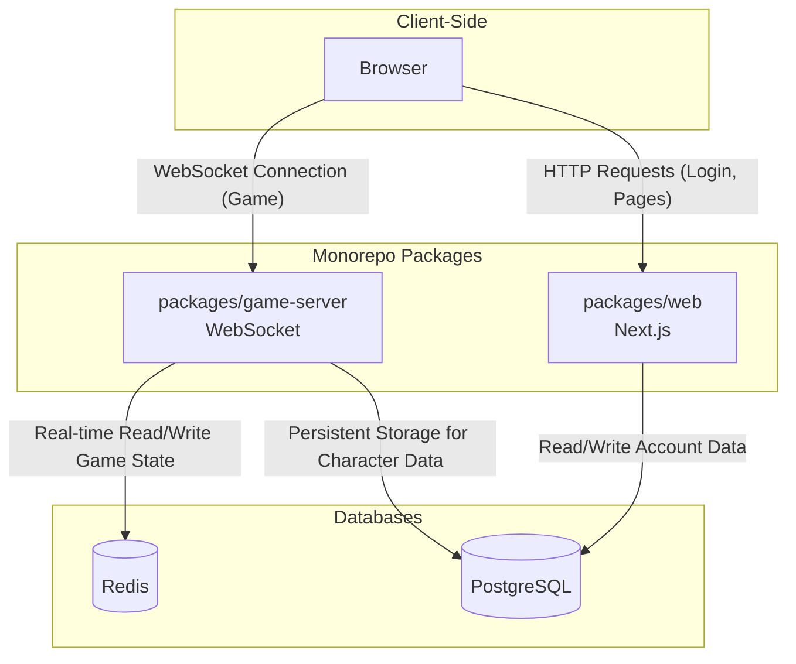

# Anima - A Modern MUD Game Framework

Anima is a reusable text-based game (MUD) core framework built with a modern tech stack and architecture. Its central design philosophy is the separation of the generic **Game Core** from the specific **Game Logic**, much like the chassis and body of a car. This allows developers to build a wide variety of games on top of a stable and robust "chassis".

## Core Philosophy: Core vs. Game Logic

  - **The Core**: Acts as the car's **chassis**. It provides the engine, event system, object model, and other fundamental capabilities, defining "how it works".
  - **Game Logic**: Is like the car's **body**. It defines the specific content of the game world, such as scenes, NPCs, and quests, defining "what it looks like".

## Project Status

**Phase 1: Core Foundation - ✅ Completed**

  - `[x]` Project Initialization: Monorepo workspace setup.
  - `[x]` Shared Type Definitions (`shared`).
  - `[x]` Base Object Implementation (`core`).
  - `[x]` Event System (`core`).
  - `[x]` Service Manager (`core`).

**Phase 2: Game Server Bootstrap - In Progress**

  - `[x]` Server foundation and network layer implementation.
  - `[x]` State management integration with Redis.
  - `[x]` Game Loop implementation.

*For a more detailed development roadmap, please refer to the [Implementation Plan](https://www.google.com/search?q=zmax/anima/anima-e6d6f70e1652a4d7741f2a594c0df471bb590e21/memory-bank/07_Implementation_Plan.md).*

## System Architecture

This project uses a Monorepo architecture to separate the frontend and backend services, ensuring high performance and scalability.



### Core Components (`packages/`)

  - **`core`**: The generic game engine providing fundamental mechanics like the game loop, object model, and event system.
  - **`game-server`**: A standalone WebSocket server that acts as the heart of the MUD, handling all real-time game logic.
  - **`web`**: A Next.js application for handling user registration/login and providing the game client UI.
  - **`shared`**: Contains TypeScript type definitions shared between the frontend and backend.
  - **`utils`**: Provides common utility functions, such as the UUID generator.

### Data Storage

  - **Redis**: Manages all active game states (Hot Data).
  - **PostgreSQL**: Stores persistent data such as player accounts and character saves (Cold Data).

## Getting Started

We use Docker to manage the project's external dependencies (PostgreSQL, Redis) to ensure a consistent, clean, and easy-to-launch development environment for all developers.

### 1\. Prerequisites

  - Node.js (for the recommended version, please see the `packageManager` field in `package.json`)
  - pnpm
  - Docker Desktop

### 2\. Install Dependencies

In the project root directory, run:

```bash
pnpm install
```

### 3\. Start Backend Services

Use Docker Compose to start all backend infrastructure (Redis, PostgreSQL) with a single command:

```bash
docker compose up -d
```

### 4\. Start Development Servers

We use `concurrently` to run the backend game server (`game-server`) and the frontend web app (`web`) in parallel. In the project root, execute:

```bash
pnpm dev
```

At this point:

  - The **Game Server** will start a WebSocket service on `http://localhost:4000`.
  - The **Web Client** (currently under development) will start.

### 5\. Stopping Services

  - To stop the development servers, press `Ctrl + C` in the terminal.
  - To stop the Docker containers, run:
    ```bash
    docker compose down
    ```

## Key Design Concepts

  - **Soul/Body Decoupling**: The player's network connection (`PlayerConnection`) is decoupled from the in-game `Character`, offering great flexibility for features like possession and observer modes.
  - **Dynamic Action System**: Interactive options (Actions) in the game are decentralized and provided dynamically by the environment (e.g., rooms, items), rather than being hardcoded in a central system.
  - **Composition Over Inheritance**: We avoid complex inheritance chains. Instead, we use the Mixin pattern to grant objects foundational capabilities and the Composition pattern to attach complex functional modules.
  - **Service Locator Pattern**: The `ServiceManager` acts as a singleton, providing a central registry to decouple service consumers from providers throughout the application.

## License

ISC
