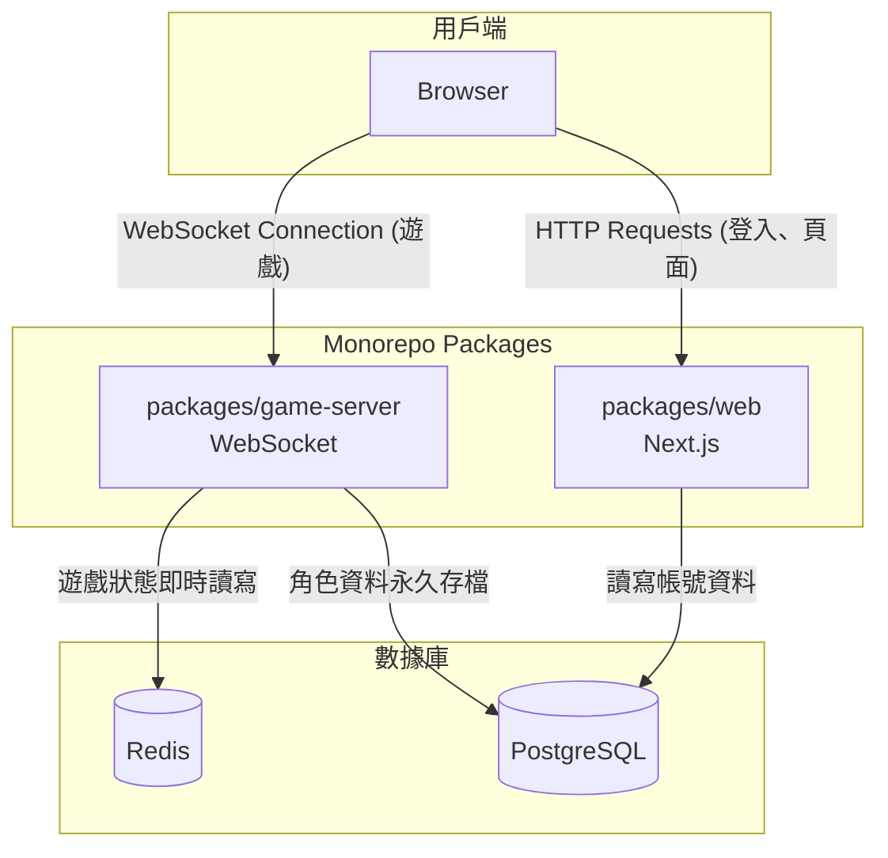

# 總體架構概覽 (Architecture Overview)

本專案採用一個現代化的 Monorepo 架構，將遊戲後端與 Web 前端分離，以確保高效能、可擴展性和可維護性。

## 核心組件 (Packages)

1. **`web` (前端 - Next.js)**: 處理傳統 HTTP 請求（註冊/登入），並提供遊戲客戶端 UI。
    
2. **`game-server` (後端 - Standalone Node.js)**: 獨立的 WebSocket 伺服器，作為 MUD 的心臟，處理所有即時遊戲邏輯。
    
3. **`core` (核心引擎)**: 通用的遊戲框架，提供遊戲循環、物件模型、事件系統等基礎能力。
    
4. **`shared` (共享程式碼)**: 包含前後端共用的 TypeScript 類型定義。
    

## 數據存儲

- **Redis (線上世界/Hot Data)**: 管理所有活躍的遊戲狀態。
    
- **PostgreSQL / MongoDB (永久存檔/Cold Data)**: 儲存永久性資料。
    

## 系統互動流程圖

